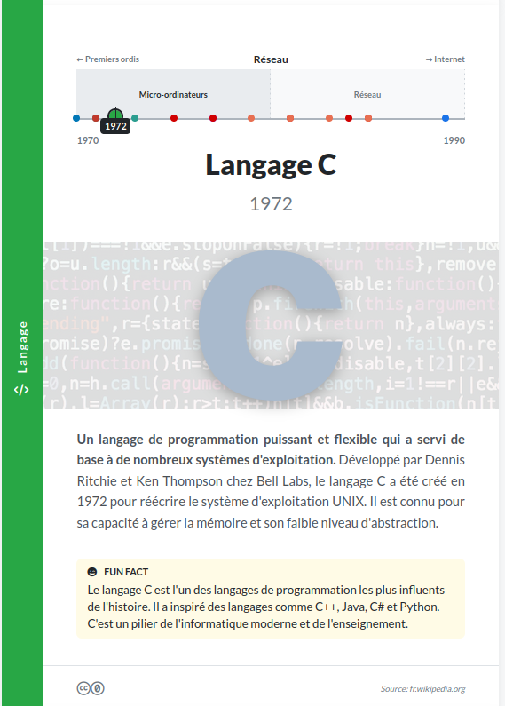

# Générateur de Cartes Pédagogiques pour Fresque Temporelle

Bienvenue ! Ce projet est un outil puissant et flexible conçu pour transformer des données historiques structurées en un jeu de cartes pédagogiques professionnelles au format A5, prêtes à l'impression. Initialement développé pour une fresque sur l'histoire de l'informatique, son architecture modulaire permet de l'adapter à n'importe quel sujet chronologique (histoire de l'art, géologie, biographies, etc.).

Le script principal, écrit en Node.js, lit des fichiers de données au format CSV et génère un document PDF haute fidélité contenant une carte pour chaque événement.


*(Remplacez cette image par une capture d'écran d'une de vos cartes)*

## Fonctionnalités

*   **Génération Automatisée** : Crée des dizaines de cartes en une seule commande.
*   **Données Structurées** : Toute la logique est pilotée par des fichiers CSV faciles à éditer.
*   **Format Prêt à l'Impression** : Les cartes sont générées au format A5 avec un rendu pixel-perfect grâce à Puppeteer.
*   **Timeline Dynamique et Proportionnelle** : Chaque carte affiche une timeline de sa période, avec toutes les sous-périodes et les événements contemporains positionnés proportionnellement à leur date.
*   **Design Riche et Thématique** :
    *   Bordure latérale colorée basée sur la catégorie de l'événement.
    *   Bandeau d'arrière-plan thématique et semi-transparent derrière l'image principale.
    *   Mise en exergue des mots-clés avec la couleur de la catégorie.
    *   Encadrés anecdotiques ("Le saviez-vous", "Fun fact", etc.) avec icônes et couleurs dédiées.
*   **Code Modulaire et Personnalisable** : L'architecture est découpée en modules logiques (configuration, chargement des données, génération HTML/PDF) et en fichiers CSS spécialisés, rendant la personnalisation très accessible.

## Architecture du Projet

Le projet est structuré de manière à séparer clairement les données, la logique et les fichiers générés.

fresque-informatique/
│
├── data/ // Vos fichiers de données
│ ├── categories.csv
│ ├── histoire_informatique_evenements.csv
│ └── periodes.csv
│
├── output/ // Le PDF final est généré ici
│ └── fresque_temporelle.pdf
│
├── src/ // Le coeur de la logique du script
│ ├── config.js // Configuration (icônes, bannières, noms de fichiers)
│ ├── dataLoader.js // Module de lecture et de parsing des données
│ ├── htmlGenerator.js // Module de génération du HTML
│ └── pdfGenerator.js // Module de création du PDF
│
├── styles/ // Le code CSS, découpé par fonctionnalité
│ ├── main.css // Fichier principal important les autres
│ ├── _base.css // Styles globaux
│ ├── _card.css // Structure de la carte
│ ├── _content.css // Contenu (textes, notes, image)
│ ├── _timeline.css // Styles de la timeline
│ ├── _variables.css // Toutes les variables de couleurs et polices
│ └── _print.css // Styles pour l'impression
│
├── generate-cards.js // Script principal à exécuter
├── README.md // Ce fichier
└── package.json


## Installation

Pour utiliser ce projet, vous devez avoir Node.js installé sur votre machine.

1.  **Prérequis** : Installez [Node.js](https://nodejs.org/) (version 16 ou supérieure recommandée).

2.  **Cloner le projet** (ou téléchargez les fichiers) et ouvrez un terminal à la racine du dossier.

3.  **Installer les dépendances** : Exécutez la commande suivante. Elle installera Puppeteer et PapaParse.
    ```bash
    npm install
    ```

## Structure des Fichiers de Données

Pour que le script fonctionne, vos fichiers de données dans le dossier `data/` doivent respecter une structure précise.

### `histoire_informatique_evenements.csv`

C'est le fichier principal. Chaque ligne représente une carte.

| En-tête                    | Description                                                                                                    |
| ---------------------------- | -------------------------------------------------------------------------------------------------------------- |
| `Titre`                      | Le titre principal de la carte.                                                                                |
| `Description courte`         | L'accroche affichée en premier. Peut contenir des mots-clés entourés de `**` pour les mettre en exergue.        |
| `Description`                | Le reste de la description, qui suivra la description courte. Peut aussi contenir des mots-clés.               |
| `Note`                       | Le texte de l'anecdote (ex: "Il a inventé le terme 'bug'...").                                                   |
| `Note Type`                  | Le type de note (ex: "Fun fact"). Doit correspondre à une entrée dans `Note Type.csv`.                          |
| `Date`                       | L'année de l'événement (ex: `1957` ou `-300`).                                                                  |
| `Période`                    | Le nom de la période principale. Doit correspondre à une `Période` de `periodes.csv`.                            |
| `Sous-période`               | Le nom de la sous-période. Doit correspondre à une `Sous-période` de `periodes.csv`.                             |
| `Catégorie`                  | La thématique de l'événement. Doit correspondre à un `Nom` dans `categories.csv`.                                |
| `Lien image libre de droit`  | L'URL complète de l'image principale de la carte.                                                              |
| `Source`                     | L'URL de la source. Le script extraira automatiquement le nom de domaine.                                      |

### `periodes.csv`

Ce fichier définit la structure de la timeline. Chaque ligne représente une sous-période.

| En-tête                     | Description                                            |
| --------------------------- | ------------------------------------------------------ |
| `Période`                   | Nom complet de la période principale (ex: "Révolution mécanique"). |
| `Abréviation Période`       | Nom court pour les flèches de la timeline (ex: "Mécanique"). |
| `Début`                     | Année de début de la période principale.                 |
| `Fin`                       | Année de fin de la période principale.                   |
| `Sous-période`              | Nom complet de la sous-période (ex: "Inventions mécaniques"). |
| `Abréviation Sous-période`  | Nom court utilisé si le nom complet est trop long.     |
| `Début SP`                  | Année de début de la sous-période.                       |
| `Fin SP`                    | Année de fin de la sous-période.                         |

### `categories.csv`

Définit les thématiques et leurs abréviations.

| En-tête        | Description                                                       |
| -------------- | ----------------------------------------------------------------- |
| `Nom`          | Nom complet de la catégorie (ex: "Intelligence Artificielle").    |
| `Abbreviation` | Version courte affichée dans la barre latérale (ex: "IA").        |

## Utilisation

1.  Assurez-vous que vos fichiers de données sont correctement remplis et placés dans le dossier `data/`.
2.  Ouvrez un terminal à la racine du projet.
3.  Lancez la commande suivante :
    ```bash
    node generate-cards.js
    ```
4.  Le script va traiter les données, générer le HTML, puis le PDF. Le fichier final se trouvera dans `output/fresque_temporelle.pdf`.

## Personnalisation

Ce projet est conçu pour être facilement adaptable.

*   **Changer les couleurs et les polices** : Le fichier `styles/_variables.css` centralise toutes les variables de design. Modifiez une couleur ici, et elle sera mise à jour sur toutes les cartes.

*   **Changer les icônes et les bandeaux** : Le fichier `src/config.js` contient les mappings entre les noms de catégories (ou de notes) et leurs icônes/bandeaux respectifs. Vous pouvez facilement modifier une URL ou ajouter une nouvelle entrée.

*   **Modifier la mise en page** : Les fichiers CSS dans le dossier `styles` sont découpés par responsabilité (`_card.css` pour la structure, `_timeline.css` pour la timeline, etc.), ce qui facilite les modifications de style ciblées.

## Licence

Ce projet est distribué sous la licence MIT. Cela signifie que vous êtes libre de l'utiliser, de le modifier et de le distribuer pour n'importe quel usage, y compris commercial, à condition de conserver la notice de copyright.

MIT License

Copyright (c) 2024 TimelineNSI

Permission is hereby granted, free of charge, to any person obtaining a copy
of this software and associated documentation files (the "Software"), to deal
in the Software without restriction, including without limitation the rights
to use, copy, modify, merge, publish, distribute, sublicense, and/or sell
copies of the Software, and to permit persons to whom the Software is
furnished to do so, subject to the following conditions:

The above copyright notice and this permission notice shall be included in all
copies or substantial portions of the Software.

THE SOFTWARE IS PROVIDED "AS IS", WITHOUT WARRANTY OF ANY KIND, EXPRESS OR
IMPLIED, INCLUDING BUT NOT LIMITED TO THE WARRANTIES OF MERCHANTABILITY,
FITNESS FOR A PARTICULAR PURPOSE AND NONINFRINGEMENT. IN NO EVENT SHALL THE
AUTHORS OR COPYRIGHT HOLDERS BE LIABLE FOR ANY CLAIM, DAMAGES OR OTHER
LIABILITY, WHETHER IN AN ACTION OF CONTRACT, TORT OR OTHERWISE, ARISING FROM,
OUT OF OR IN CONNECTION WITH THE SOFTWARE OR THE USE OR OTHER DEALINGS IN THE
SOFTWARE.